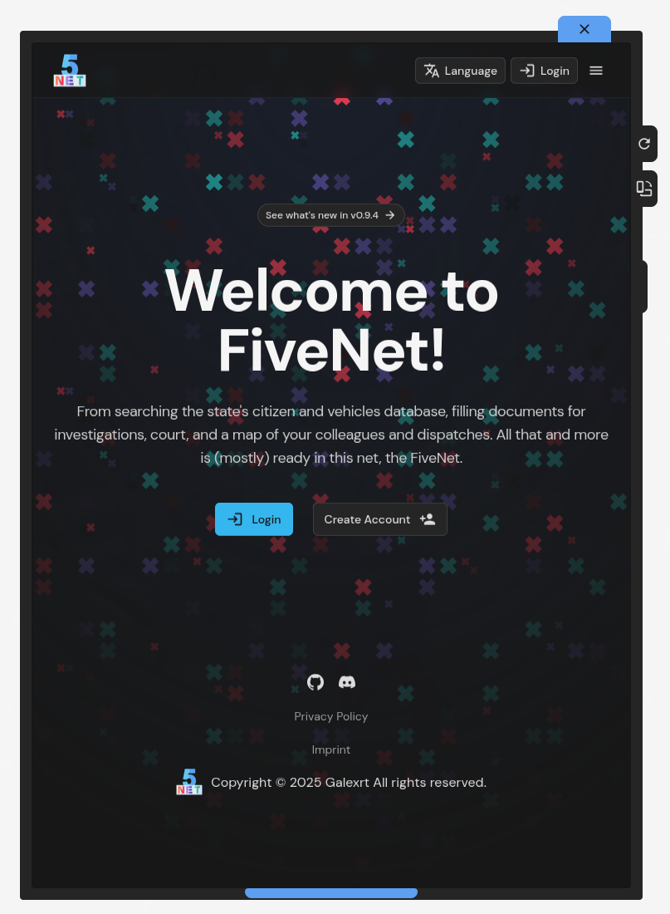
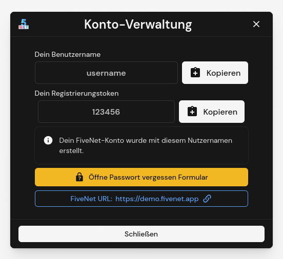

# plugins

FiveNet Gameserver Plugin code (currently available only for FiveM).

> [!TIP]
> To install the plugin in your server, it is recommended to use the pre-built release ZIP files provided via the [Releases Page](https://github.com/fivenet-app/plugins/releases).
>
> Make sure to always use the latest version of the plugin, as older versions may not be compatible with the latest FiveNet server versions.

## FiveM Plugin

See [`fivem/fivenet/` directory](fivem/fivenet/) for the code and details. Make sure to check [the plugin requirements section](fivem/fivenet/README.md#requirements).

## License

Code licensed under Apache 2.0 license, see [LICENSE](LICENSE).
