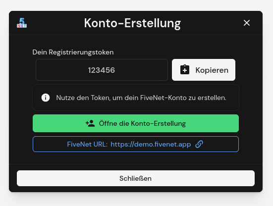

# plugins

FiveNet Gameserver Plugin code (currently available only for FiveM).

## FiveM Plugin

See [`fivem/` directory](fivem/) for the code and details.

## License

Code licensed under Apache 2.0 license, see [LICENSE](LICENSE).
